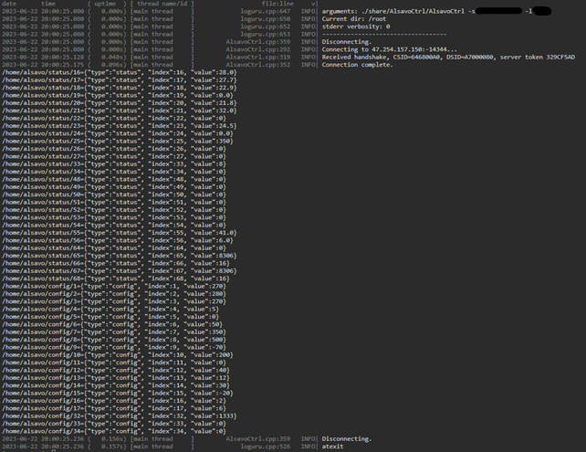
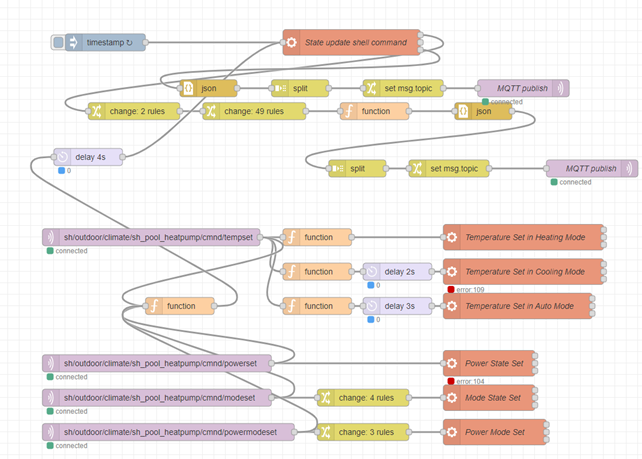
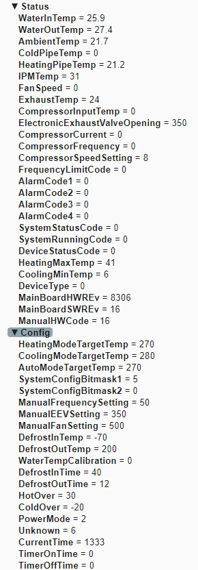
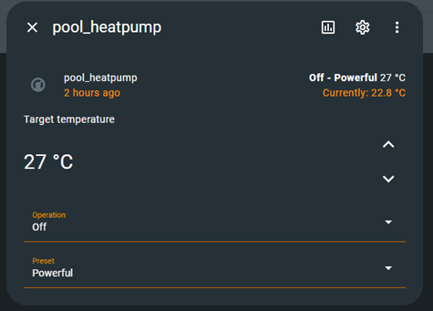
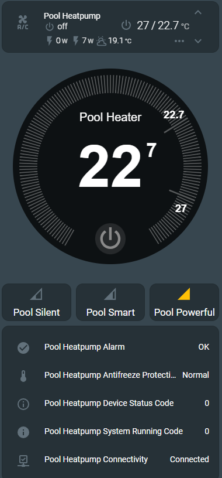
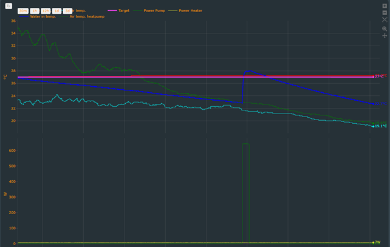

# Alsavo-Hass
Usage of [strandborg/AlsavoCtrl](https://github.com/strandborg/AlsavoCtrl) to integrate the Alsavo (Swim&amp;Fun water heatpumps) further into home assistant via command and MQTT publishing and integration of HVAC entity, allowing full control and monitoring via Home Assistant lovelace interface.

The process involves four main steps (A through D) which are detailed below. To go through, you must have first set up your wifi enable heatpump through the AlsavoPro app and set-up a password.
This tutorial shows how to compile and run AlsavoCtrl directly into the Home Assistant OS CLI.

# A.	Installing and running AlsavoCtrl on Home Assistant OS
Download the whole source code and place it on your Hass server. https://github.com/strandborg/AlsavoCtrl.git, unzip in a folder called AlsavoCtrl.
For this example I chose to place the folder on the Hass server under \share\AlsavoCtrl but you may do that from any location on your server accessible from CLI.
You can do that via Samba Share, or SSH and edit the file opening it with WordPad or similar.
Go to the folder and Edit the loguru.cpp file: change LOGURU_STACKTRACES in line 97 to 0.
So it reads: ‘#define LOGURU_STACKTRACES 0’
Now you need to have access to Home Assistant CLI via “terminal& SSH” which is installed as a standard add-on on HassOS. Further details here: https://github.com/hassio-addons/addon-ssh
Once in CLI, run the following commands one after the other.

1.	
Run:
```
cd share/AlsavoCtrl/
```
2. 
Run:
```
apk add cmake make musl-dev build-base linux-headers curl-dev
```
There is should run an install of cmake and success at 100%

3.	
Run:
```
cmake --clean-first -DCMAKE_EXE_LINKER_FLAGS="-static -Os" .
```
It should conclude with:
`--Generating done
--Build files have been written to :/root/share/AlsavoCtrl`

4.
Finally run:
```
make
```
You should have received a successful notification:
`[100%] Built target AlsavoCtrl`

# B.	Running AlsavoCtrl and connect to your heatpump
You should now be able to test your newly built function by entering the command:
`./share/AlsavoCtrl/AlsavoCtrl -s <YourSerialNumber> -l <YourPassword>`
You can find the registered serial by tapping on the “Alsavo Pro” logo on the top right corner when in the control UI of the Heatpump on the App.
The password is the one set-up in when registering the heatpump in the app.

Your command should look like this:
```
./share/AlsavoCtrl/AlsavoCtrl -s xxxxxxxxxxxx -l xyzxyz
```
The output looks like this:



You can also try to contact the heatpump locally without going through the Alsavo server with the following command:
```
./share/AlsavoCtrl/AlsavoCtrl -s <YourSerialNumber> -l <YourPassword> -a <YourHeatpumpLocalIP> -p 1194
```
The output should be identical.
# C.	Running AlsavoCtrl in NodeRed and publishing to MQTT
Now that you have that sorted, we can run the command from within NodeRed, parse the output and publish it to your MQTT server.
For you need to have NodeRed installed and MQTT installed and running, both are standard add-ons from the add-on store of Home Assistant.  I will not in get into details here, and there are plenty of tutorials out there helping with setting this all up.
Within NodeRed, we will create two main processes:
1.	One set of flow which will run the AlsavoCtrl Command at regular interval, and parses the output to send the data in the right format to MQTT,
2.	Another series of flow to receive command and execute the AlsavoCtrl function to control the heatpump and re-run the command to publish the response to MQTT.
The fastest for a new user to NodeRed is to import the flows I created here: `AlsavoCtrlNodeRedFlow.txt`, and change with your Serial Number and Password. And add local IP and port for local connect (my preference).
Once imported in NodeRed, it should look like that:



Also, you should feel free to change the topics for MQTT publishing and listening.
The delays are to avoid simultaneous command runs and may need to be adjusted depending on your server.
If successful, you should be able to see the following published in you MQTT server (Displayed here using MQTT Explorer):



# D.	Integrating with MQTT HVAC in Home assistant configuration.yaml
From here we enter into more standard Home Assistant functions. 
Starting with creating a MQTT HVAC entity. https://www.home-assistant.io/integrations/climate.mqtt/

The yaml code is `mqttHVAC and sensors.txt`

Copy that part in your configuration.yaml
It creates a climate.name entity and should look like that:



# E.	Display and usage in Home Assistant lovelace
Lovelace card using mini-climate card and thermostat-card custom cards from HACS: 



Various plots using plotly:



# Reflections:
I am sure there are much smarter ways to run the AlsavoCtrl command and parse the output to MQTT, the docker method is one example. One might also have considered re-writing the AlsavoCtrl function altogether instead of the clumsy and inelegant string parsing in NodeRed. But I did not investigate this until it was too late as it grew organically without a clear initial plan. And here we are, I hope it helps.

Ultimately the cleanest way to do all this is a proper Home Assistant custom integration (HACS), which would be set-up through a config flow process. I do not have the skills to do that, but I would be of course willing to help anyone with the knowledge for that process.

# F.	Bonus: Control circulation pump from the heat pump
So one can wire the circulation pump to effectively have the heat pump supply power to the pump when needed for the heat pump. But by doing so I lose the ability to control the circulation/filter pump on a schedule for other reasons.
So I decided to run the water circulation with a sonoff POW R2 switch and an automation which tun-on/off as the heat pump needs, based on the published “Device Status Code”.
See automation yaml extract: `Automation Pool pump control.txt`
Now all there is to do is to turn on and off the heat pump and I think I nailed the codes for which the circulation pump needs to be on. I have run this for the last 2 years, and have had no issue, including frost protection, when the air temperature gets below 4 degrees, the water circulation is needed every so often to control the temperature of the water.
Naturally, for this to work you need Wi-Fi ! Which means in case of connectivity loss, in very cold weather, then your heat pump can freeze and get damaged!

# Credits
Main contribution: 
https://github.com/strandborg

The good people helping out here:
https://community.home-assistant.io/t/compile-and-use-executable-to-control-heatpump-through-ha


